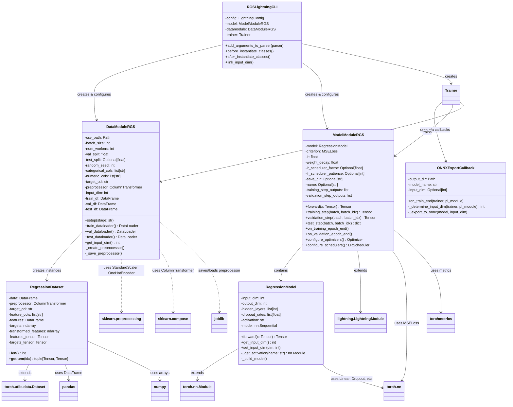
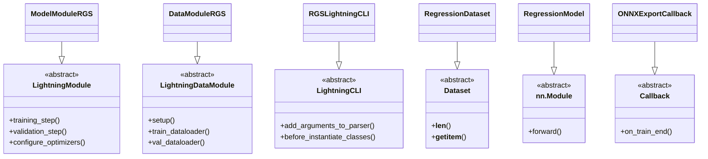
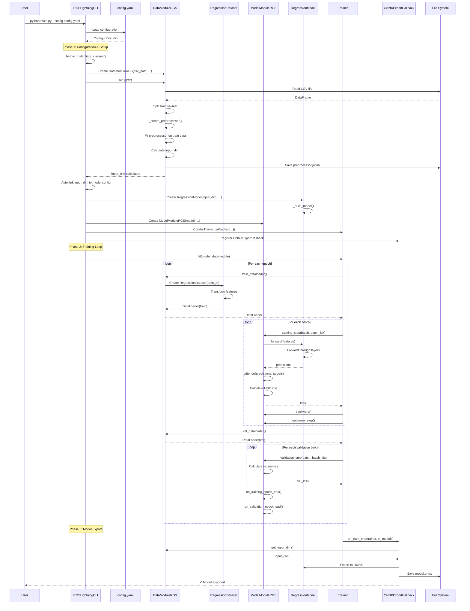
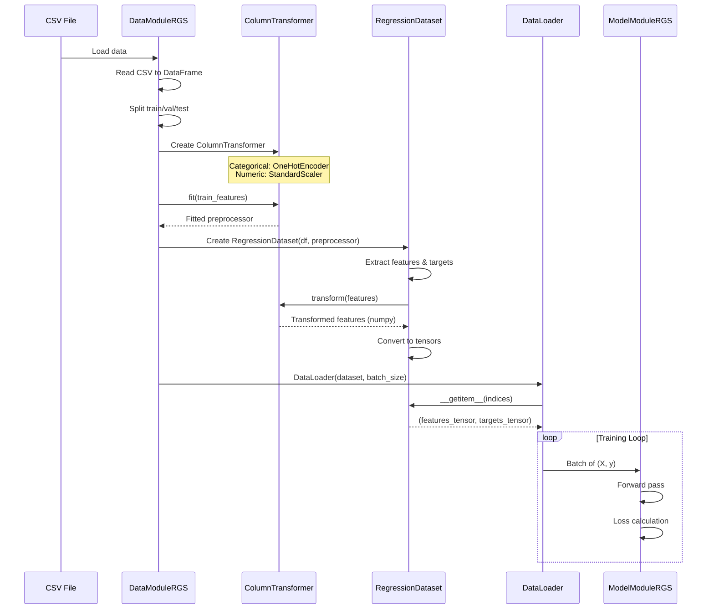
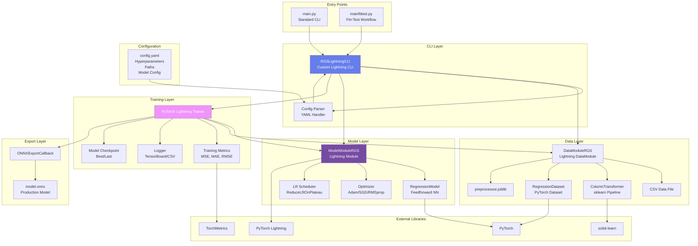
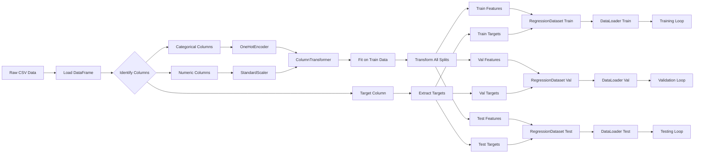
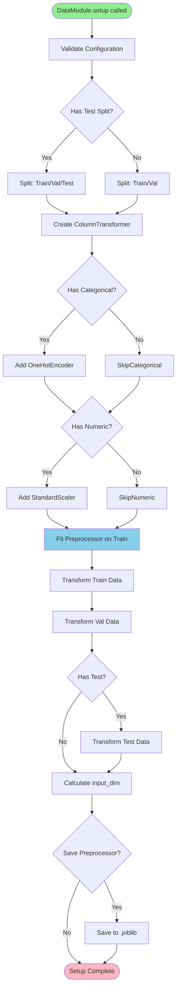

# Regression Module - UML Diagrams & Architecture Documentation

This document provides comprehensive UML diagrams and architectural documentation for the Regression module, a reusable PyTorch Lightning pipeline for tabular regression tasks.

## Table of Contents

1. [Architecture Overview](#architecture-overview)
2. [Class Diagrams](#class-diagrams)
3. [Sequence Diagrams](#sequence-diagrams)
4. [Component Diagrams](#component-diagrams)
5. [Activity Diagrams](#activity-diagrams)
6. [Class-Level Details](#class-level-details)

---

## Architecture Overview

The Regression module is a generic, config-driven pipeline for training regression models on tabular data. It follows the PyTorch Lightning framework and implements a modular architecture with clear separation of concerns:

- **Data Layer**: Handles data loading, preprocessing, and splits
- **Model Layer**: Defines neural network architecture
- **Training Layer**: Manages training loop, optimization, and metrics
- **CLI Layer**: Provides command-line interface for execution
- **Export Layer**: Handles model export for production

---

## Class Diagrams

### Complete Class Diagram

### Inheritance Hierarchy

---

## Sequence Diagrams

### Training Workflow Sequence

### Data Flow Sequence

---

## Component Diagrams

### System Architecture

### Data Processing Pipeline

---

## Activity Diagrams

### Training Process Flow

```mermaid
flowchart TD
    Start([Start Training]) --> LoadConfig[Load config.yaml]
    LoadConfig --> ParseConfig[Parse Configuration]
    ParseConfig --> CreateDM[Create DataModuleRGS]
    CreateDM --> SetupDM[Setup DataModule]
    SetupDM --> LoadCSV[Load CSV Data]
    LoadCSV --> SplitData{Split Data?}
    SplitData -->|Yes| TrainValTest[Split: Train/Val/Test]
    SplitData -->|No| TrainVal[Split: Train/Val]
    
    TrainValTest --> CreatePreprocessor[Create Preprocessor]
    TrainVal --> CreatePreprocessor
    CreatePreprocessor --> FitPreprocessor[Fit Preprocessor on Train]
    FitPreprocessor --> CalcInputDim[Calculate input_dim]
    CalcInputDim --> SavePreprocessor{Save Preprocessor?}
    SavePreprocessor -->|Yes| SavePrep[Save to .joblib]
    SavePreprocessor -->|No| CreateModel
    SavePrep --> CreateModel[Create RegressionModel]
    
    CreateModel --> LinkInputDim[Auto-link input_dim]
    LinkInputDim --> CreateModule[Create ModelModuleRGS]
    CreateModule --> CreateTrainer[Create Trainer]
    CreateTrainer --> AddCallbacks[Add Callbacks]
    
    AddCallbacks --> StartTraining[Start Training Loop]
    StartTraining --> Epoch{More Epochs?}
    
    Epoch -->|Yes| TrainBatch[Process Training Batch]
    TrainBatch --> ForwardPass[Forward Pass]
    ForwardPass --> CalcLoss[Calculate MSE Loss]
    CalcLoss --> Backward[Backward Pass]
    Backward --> UpdateWeights[Update Weights]
    UpdateWeights --> ValBatch{Validation?}
    
    ValBatch -->|Yes| ValForward[Validation Forward]
    ValForward --> ValMetrics[Calculate Val Metrics]
    ValMetrics --> LogMetrics[Log Metrics]
    LogMetrics --> Checkpoint{Save Checkpoint?}
    
    ValBatch -->|No| Checkpoint
    Checkpoint -->|Yes| SaveCheckpoint[Save Model]
    Checkpoint -->|No| Epoch
    SaveCheckpoint --> Epoch
    
    Epoch -->|No| ExportONNX[Export to ONNX]
    ExportONNX --> End([Training Complete])
    
    style Start fill:#90EE90
    style End fill:#FFB6C1
    style ExportONNX fill:#87CEEB
```

### Data Module Setup Flow

---

## Class-Level Details

### RGSLightningCLI

**Purpose**: Custom CLI that extends LightningCLI to add regression-specific functionality.

**Key Responsibilities**:
- Parse YAML configuration files
- Instantiate DataModule, Model, and Trainer
- Auto-link `input_dim` from DataModule to Model
- Handle checkpoint paths for resume/testing

**Key Methods**:
- `before_instantiate_classes()`: Auto-detects `input_dim` from DataModule
- `after_instantiate_classes()`: Fallback method to set `input_dim` if needed
- `add_arguments_to_parser()`: Adds custom CLI arguments

---

### DataModuleRGS

**Purpose**: Manages data loading, preprocessing, and splits for regression tasks.

**Key Responsibilities**:
- Load CSV data
- Create and fit preprocessing pipeline
- Split data into train/val/test
- Calculate input dimensions
- Save/load preprocessor for inference

**Key Attributes**:
- `preprocessor`: sklearn ColumnTransformer (fitted)
- `input_dim`: Calculated feature dimension after preprocessing
- `train_df`, `val_df`, `test_df`: Split dataframes

**Key Methods**:
- `setup(stage)`: Prepares data splits and preprocessor
- `train_dataloader()`: Returns DataLoader for training
- `get_input_dim()`: Returns calculated input dimension

---

### RegressionDataset

**Purpose**: PyTorch Dataset that transforms data for model consumption.

**Key Responsibilities**:
- Store preprocessed features and targets as tensors
- Provide indexed access to samples
- Handle feature transformation

**Key Attributes**:
- `features_tensor`: Preprocessed features as FloatTensor
- `targets_tensor`: Targets as FloatTensor

**Key Methods**:
- `__getitem__(idx)`: Returns (features, target) tuple for index

---

### ModelModuleRGS

**Purpose**: PyTorch Lightning module that defines training/validation/test logic.

**Key Responsibilities**:
- Define training step (forward + loss)
- Define validation/test steps with metrics
- Configure optimizer and learning rate scheduler
- Aggregate metrics across batches

**Key Attributes**:
- `model`: RegressionModel instance
- `criterion`: MSELoss for regression
- `training_step_outputs`: Collects batch outputs

**Key Methods**:
- `training_step()`: Single training batch processing
- `validation_step()`: Single validation batch processing
- `configure_optimizers()`: Returns optimizer and scheduler

---

### RegressionModel

**Purpose**: Flexible feedforward neural network for regression.

**Key Responsibilities**:
- Define neural network architecture
- Support configurable layers, dropout, activations
- Forward pass computation

**Key Attributes**:
- `input_dim`: Number of input features
- `hidden_layers`: List of hidden layer sizes
- `model`: nn.Sequential containing all layers

**Key Methods**:
- `forward(x)`: Forward pass through network
- `_build_model()`: Constructs network architecture
- `set_input_dim(dim)`: Sets input dimension if not known at init

---

### ONNXExportCallback

**Purpose**: Exports trained model to ONNX format for production deployment.

**Key Responsibilities**:
- Detect input dimensions
- Export PyTorch model to ONNX
- Save ONNX file to disk

**Key Methods**:
- `on_train_end()`: Called after training completes
- `_determine_input_dim()`: Gets input_dim from datamodule or model

---

## Data Flow Summary

1. **Configuration** → YAML file defines all hyperparameters
2. **Data Loading** → CSV file loaded into DataFrame
3. **Preprocessing** → Categorical one-hot encoded, numeric standardized
4. **Feature Calculation** → `input_dim` = total transformed features
5. **Model Creation** → Feedforward NN with `input_dim` input, 1 output
6. **Training** → Batches → Forward → Loss → Backward → Update
7. **Export** → PyTorch model → ONNX format

---

## Key Design Patterns

1. **Template Method Pattern**: Lightning framework defines training loop structure
2. **Factory Pattern**: ModelFactory creates model instances from config
3. **Strategy Pattern**: Configurable optimizers, schedulers, activations
4. **Observer Pattern**: Callbacks observe training events
5. **Adapter Pattern**: DataModule adapts raw data to PyTorch format

---

## Dependencies

### Core Dependencies
- `lightning` (PyTorch Lightning)
- `torch` (PyTorch)
- `torchmetrics` (Metrics)
- `sklearn` (Preprocessing)
- `pandas` (Data handling)
- `numpy` (Numerical operations)

### External Tools
- `onnxruntime` (ONNX inference)
- `joblib` (Model serialization)
- `tensorboard` (Logging)

---

*Last Updated: [Current Date]*
